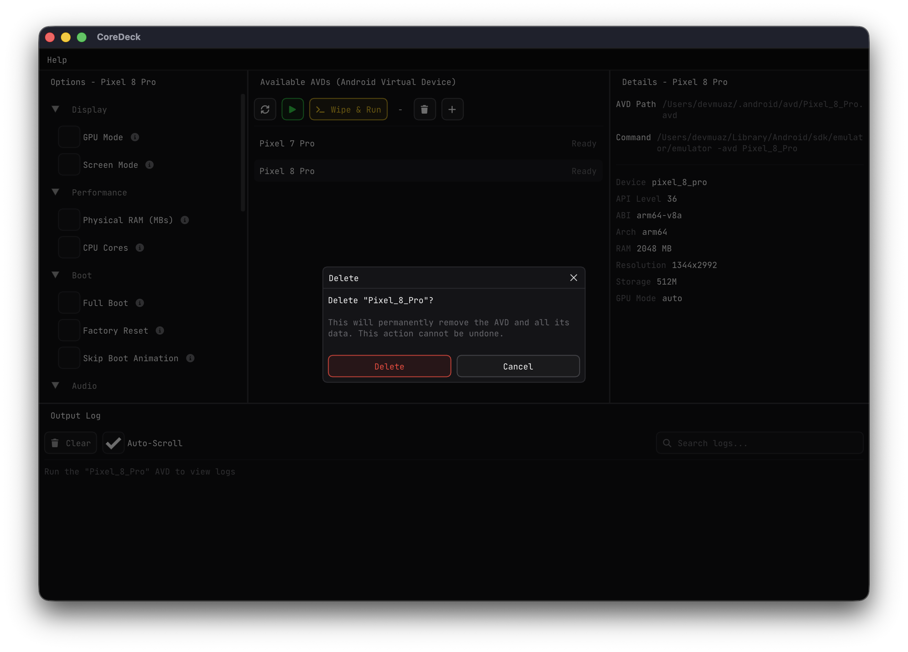

# CoreDeck

[](https://github.com/devmuaz/CoreDeck/actions/workflows/build.yml)
[](https://github.com/devmuaz/CoreDeck/actions/workflows/release.yml)
[](LICENSE)
[](https://github.com/devmuaz/CoreDeck/releases)

A fast, modern desktop app for managing and launching Android emulators — built with C++20 and Dear ImGui.

**Website:** [coredeck.dev](https://coredeck.dev)

## Features

- **AVD Management** — Create, delete, and browse your Android Virtual Devices
- **Emulator Control** — Launch, stop, or wipe & run AVDs with one click
- **Per-AVD Options** — Configure GPU, RAM, CPU cores, camera, network, boot mode, and more
- **Live Log Viewer** — Stream emulator output in real time with search and auto-scroll
- **SDK Auto-Detection** — Picks up your Android SDK from environment variables or standard paths
- **Guided Setup** — Onboarding wizard to configure the SDK on first run
- **Cross-Platform** — Runs natively on Windows, macOS, and Linux

## Preview

<div>

|                                    AVD List & Options                                     |                                   Running Emulator & Logs                                    |
|:-----------------------------------------------------------------------------------------:|:--------------------------------------------------------------------------------------------:|
|                   |          |
|              *Browse AVDs with per-device options and details*                             |                  *Live emulator output with search and auto-scroll*                          |

|                                      Create New AVD                                       |                                        Delete AVD                                            |
|:-----------------------------------------------------------------------------------------:|:--------------------------------------------------------------------------------------------:|
|                      |                             |
|              *Configure system image, device, RAM, and GPU mode*                           |                  *Confirmation dialog before permanent deletion*                             |

</div>

## Downloads

Grab the latest release for your platform from the [Releases](https://github.com/devmuaz/CoreDeck/releases) page:

| Platform | Architecture  | File            |
|----------|---------------|-----------------|
| Windows  | x86-64        | `.msi` / `.zip` |
| macOS    | Apple Silicon | `.tar.gz`       |
| Linux    | x86-64, ARM64 | `.tar.gz`       |

## Build from source

```bash
git clone --recursive https://github.com/devmuaz/CoreDeck.git
cd CoreDeck
cmake -B build -DCMAKE_BUILD_TYPE=Release
cmake --build build --config Release --parallel
```

If you already cloned without `--recursive`:

```bash
git submodule update --init --recursive
```

## License

See [LICENSE](LICENSE) for details.
