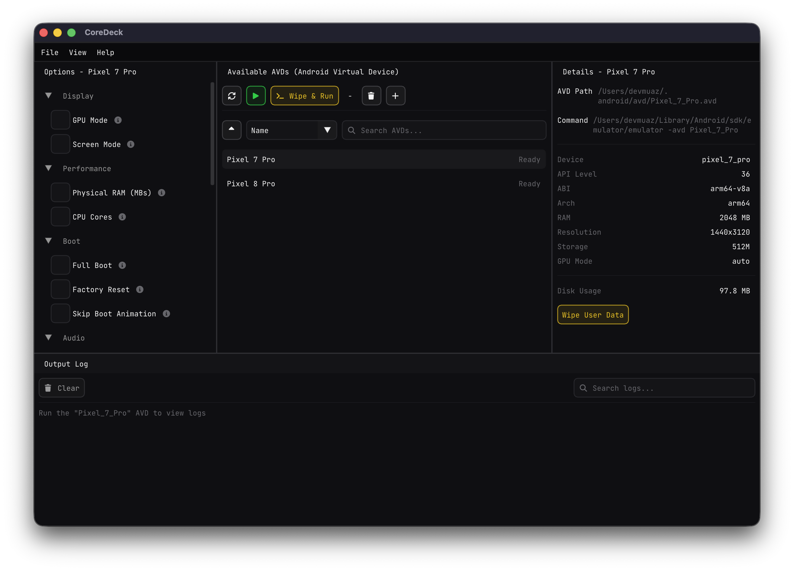
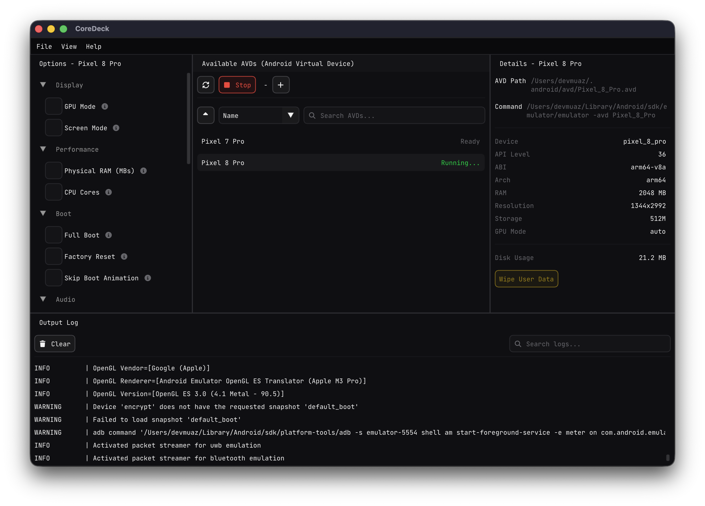
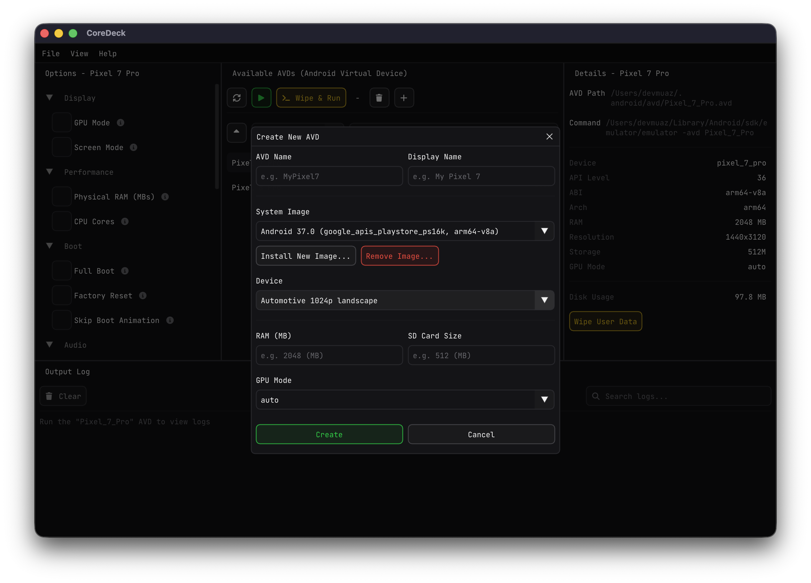
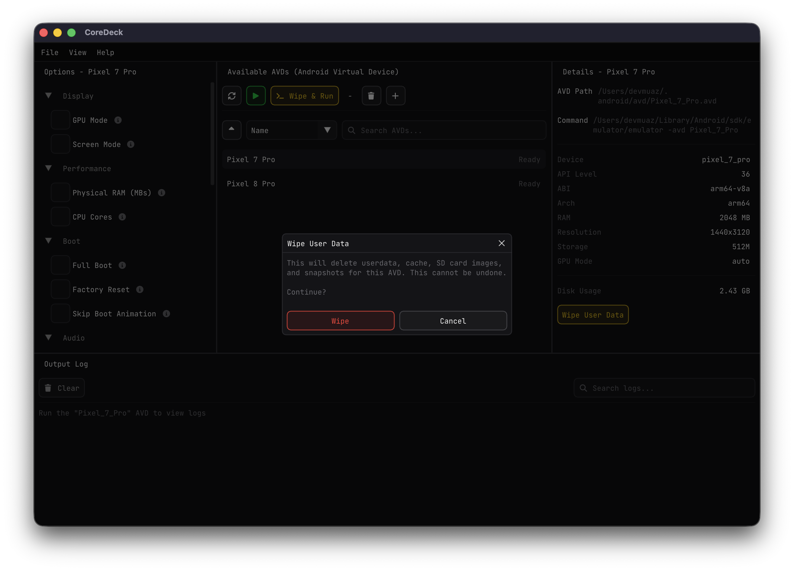

# CoreDeck

[](https://github.com/devmuaz/CoreDeck/actions/workflows/build.yml)
[](https://github.com/devmuaz/CoreDeck/actions/workflows/release.yml)
[](LICENSE)
[](https://github.com/devmuaz/CoreDeck/releases)

A native desktop application around your Android SDK’s official emulator, avdmanager, and sdkmanager binaries — CoreDeck
runs them for you in one place, through a friendly GUI, so you get the same results without hand-writing commands. Use
it for everyday work without opening Android Studio. Built with C++20 and Dear ImGui.

> [!IMPORTANT]
> You still need the Android SDK and its tooling on your machine. Installing Android Studio is the usual way to get
> them.

**Website:** [coredeck.dev](https://coredeck.dev)

## Features

- **AVD Management** — Create, delete, and browse your Android Virtual Devices
- **System Image Management** — List, install, and uninstall android system images with ease
- **Emulator Control** — Launch, stop, or wipe & run AVDs with one click
- **Per-AVD Options** — Configure GPU, RAM, CPU cores, camera, network, boot mode, and more
- **Live Log Viewer** — Stream emulator output in real time with search and auto-scroll
- **SDK Auto-Detection** — Picks up your Android SDK from environment variables or standard paths
- **Guided Setup** — Onboarding wizard to configure the SDK on first run
- **Cross-Platform** — Runs natively on Windows, macOS, and Linux

## Preview

<div>

|                            AVD List & Options                            |                               Running Emulator & Logs                                |
|:------------------------------------------------------------------------:|:------------------------------------------------------------------------------------:|
|  |  |
|            *Browse AVDs with per-device options and details*             |                  *Live emulator output with search and auto-scroll*                  |

|         Create New AVD & List, Install, Remove System Images          |                              Wipe User Data                              |
|:---------------------------------------------------------------------:|:------------------------------------------------------------------------:|
|  |  |
|          *Configure system image, device, RAM, and GPU mode*          |                    *Clear heavy and unused AVD data*                     |

</div>

## Downloads

Grab the latest release for your platform from the [Releases](https://github.com/devmuaz/CoreDeck/releases) page:

| Platform | Architecture  | File            |
|----------|---------------|-----------------|
| Windows  | x86-64        | `.msi` / `.zip` |
| macOS    | Apple Silicon | `.tar.gz`       |
| Linux    | x86-64, ARM64 | `.tar.gz`       |

## Build from source

```bash
git clone --recursive https://github.com/devmuaz/CoreDeck.git
cd CoreDeck
cmake -B build -DCMAKE_BUILD_TYPE=Release
cmake --build build --config Release --parallel
```

If you already cloned without `--recursive`:

```bash
git submodule update --init --recursive
```

## Contributing

See [CONTRIBUTING.md](CONTRIBUTING.md) for the branching model, PR guidelines, and how to get started.

## License

See [LICENSE](LICENSE) for details.
