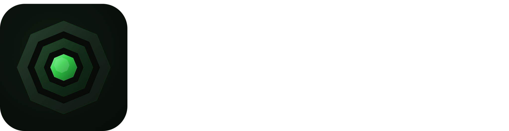
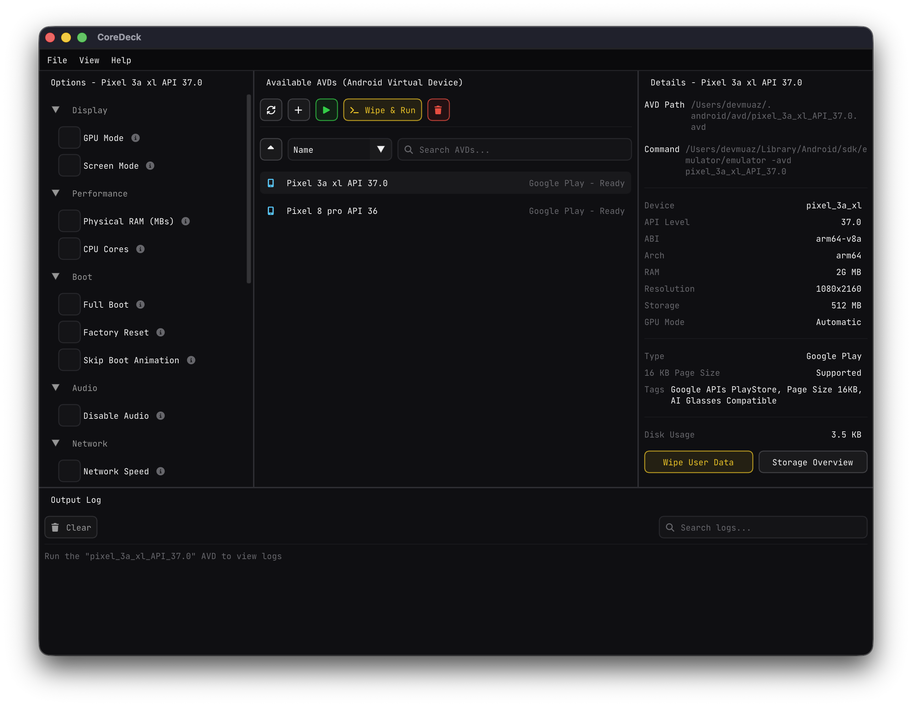
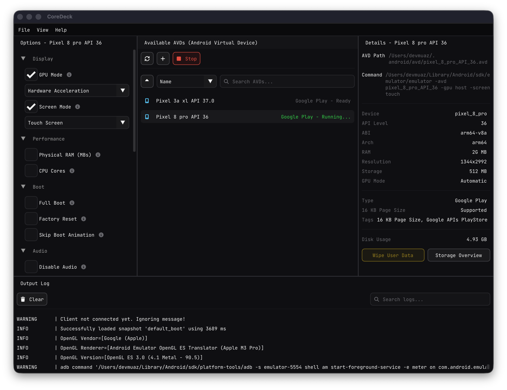
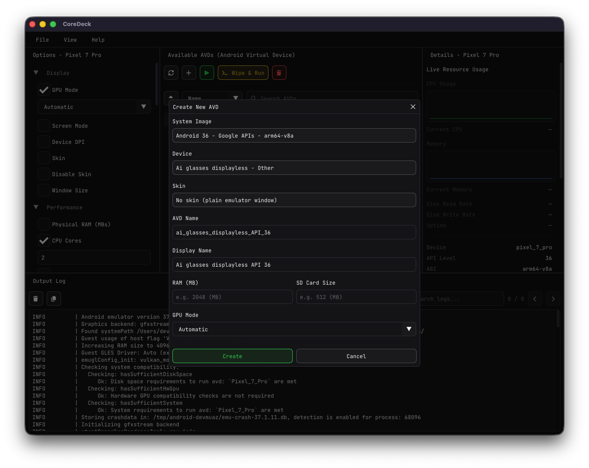
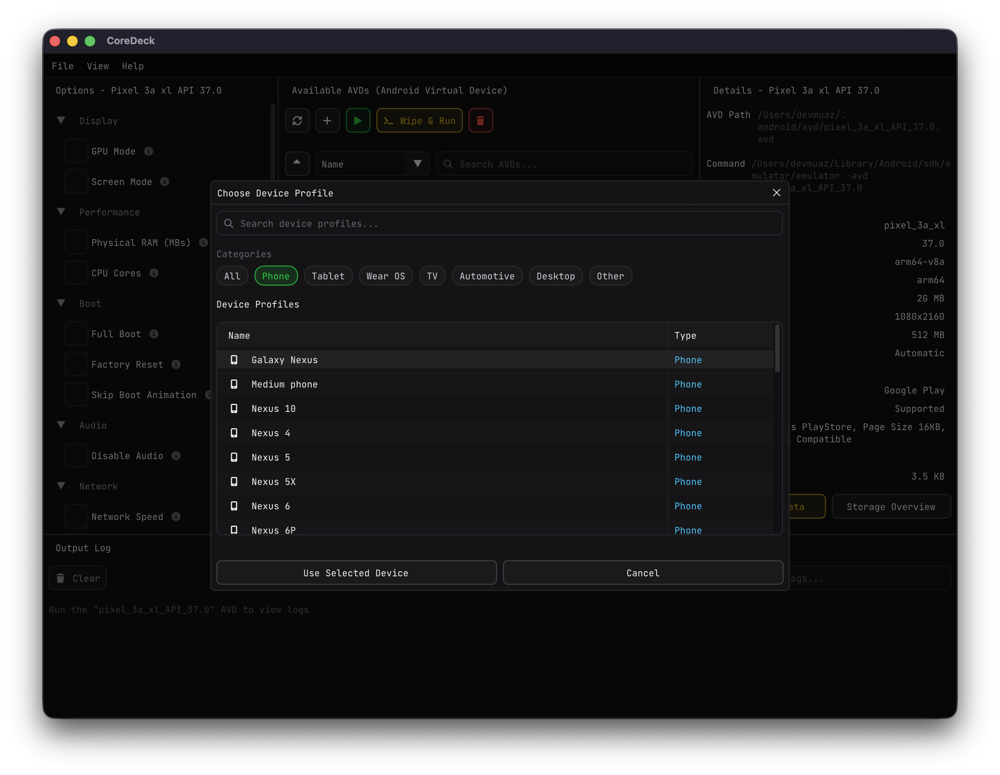
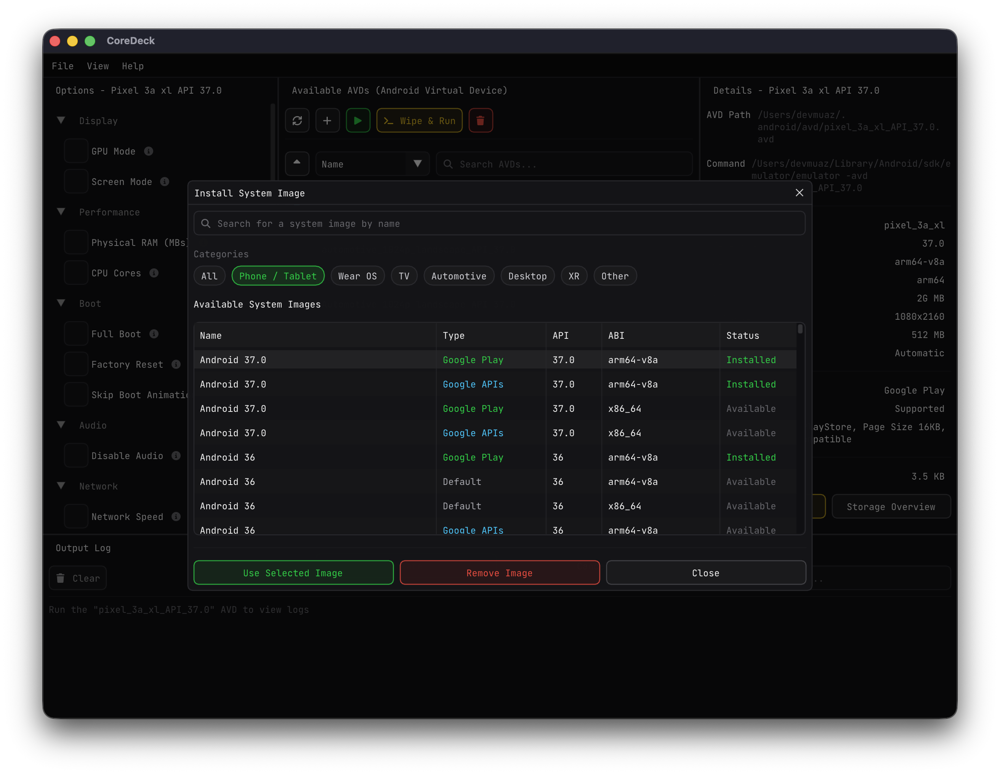
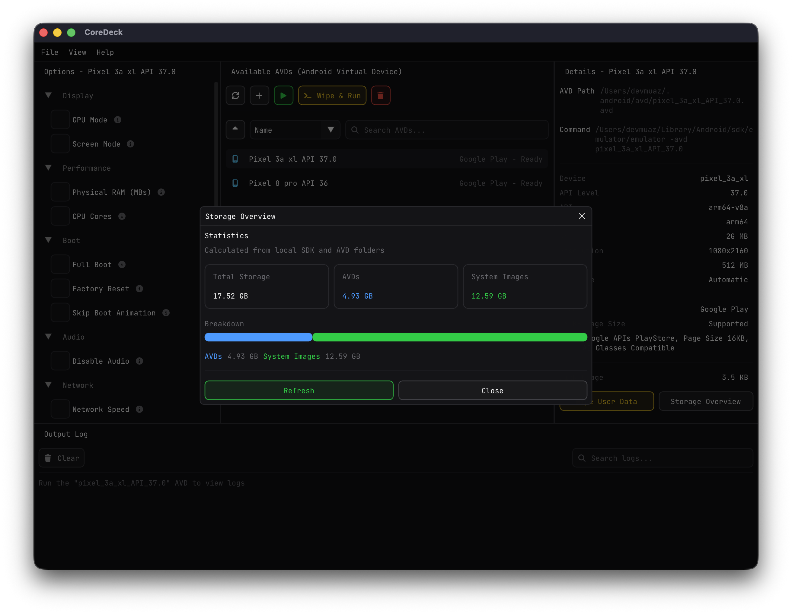

<div align="center">
  
</div>

<br />

[](https://github.com/devmuaz/CoreDeck/actions/workflows/build.yml)
[](https://github.com/devmuaz/CoreDeck/actions/workflows/release.yml)
[](https://github.com/devmuaz/CoreDeck/releases)
[](https://github.com/devmuaz/CoreDeck/releases)
[](https://github.com/devmuaz/CoreDeck/stargazers)
[](https://github.com/devmuaz/CoreDeck/issues)


[](LICENSE)

[CoreDeck](https://coredeck.dev) is an open source native desktop application around your Android SDK’s official
emulator, avdmanager, and sdkmanager binaries — running them for you in one place, through a friendly GUI, so you get
the same results without hand-writing commands. Use it for everyday work without opening Android Studio. Built with
C++20 and Dear ImGui.

> [!IMPORTANT]
> You still need the Android SDK and its tooling on your machine. Installing Android Studio is the usual way to get
> them.

<div align="center">
  <video src="https://github.com/user-attachments/assets/cade70a8-c7b4-47ac-98c1-6b8986893dcc" controls width="720"></video>
</div>

## Features

- **AVD Management** — Create, delete, and browse your Android Virtual Devices
- **System Image Management** — List, install, and uninstall Android system images with ease
- **Emulator Control** — Launch, stop, or wipe & run AVDs with one click
- **Per-AVD Options** — Configure GPU, RAM, CPU cores, camera, network, boot mode, and more
- **Live Log Viewer** — Stream emulator output in real time with search and auto-scroll
- **Storage Overview** — Inspect per-AVD disk usage and clear heavy or unused data
- **SDK Auto-Detection** — Picks up your Android SDK from environment variables or standard paths
- **Guided Setup** — Onboarding wizard to configure the SDK on first run
- **Cross-Platform** — Runs natively on Windows, macOS, and Linux

## Preview

|                            AVD List & Options                            |                               Running Emulator & Logs                                |
|:------------------------------------------------------------------------:|:------------------------------------------------------------------------------------:|
|  |  |
|            *Browse AVDs with per-device options and details*             |                  *Live emulator output with search and auto-scroll*                  |

|                            Create New AVD                             |                              Device Profile Selection                              |
|:---------------------------------------------------------------------:|:-----------------------------------------------------------------------------------:|
|  |  |
|          *Configure system image, device, RAM, and GPU mode*          |             *Pick from a rich catalog of Android device profiles*                   |

|                       System Image Browser                           |                              Storage Overview                              |
|:--------------------------------------------------------------------:|:--------------------------------------------------------------------------:|
|  |  |
|         *List, install, and remove Android system images*           |                *Inspect AVD disk usage and clear heavy data*                |

## Downloads

Grab the latest prebuilt binaries from the official [CoreDeck](https://coredeck.dev) website or the [Releases](https://github.com/devmuaz/CoreDeck/releases) page:

| Platform | Architecture          | File            |
|----------|-----------------------|-----------------|
| Windows  | x86-64                | `.msi` / `.zip` |
| macOS    | arm64 (Apple Silicon) | `.dmg`          |
| Linux    | x86-64, arm64         | `.tar.gz`       |

Each release artifact ships with a matching `.sha256` checksum for download verification.

## Requirements

- **Android SDK** with `emulator`, `avdmanager`, and `sdkmanager` available (typically installed via Android Studio).
- **OS:** Windows 10/11, macOS 12+ (Apple Silicon), or a recent Linux distribution.

To build from source you additionally need:

- **CMake** 3.23 or newer
- A **C++20** compiler — GCC 11+, Clang 14+, or MSVC 19.30+ (Visual Studio 2022)
- Linux only: the system packages listed in [Build from source](#build-from-source)

## Build from source

**Linux dependencies (Ubuntu/Debian):**

`build-essential` does not include CMake, so it's listed separately:

```bash
sudo apt-get install build-essential cmake libcurl4-openssl-dev libgl1-mesa-dev libx11-dev libxrandr-dev libxinerama-dev libxcursor-dev libxi-dev libxext-dev
```

**Build:**

```bash
git clone --recursive https://github.com/devmuaz/CoreDeck.git
cd CoreDeck
cmake -B build -DCMAKE_BUILD_TYPE=Release
cmake --build build --config Release --parallel
```

If you already cloned without `--recursive`:

```bash
git submodule update --init --recursive
```

## FAQ

**The app starts but says my Android SDK isn't detected.**
CoreDeck looks at `ANDROID_HOME` / `ANDROID_SDK_ROOT` and standard install paths. If your SDK lives elsewhere, point it
at the right location through the onboarding wizard or set the environment variable before launching.

**An emulator won't launch / boots forever.**
Make sure the matching system image is installed and that hardware acceleration is enabled (HAXM/Hyper-V on Windows,
Hypervisor.framework on macOS, KVM on Linux). The live log viewer usually shows the underlying error from `emulator`.

**Does CoreDeck replace Android Studio?**
No — it wraps the same official command-line tools that Android Studio uses, so you still need the Android SDK
installed. CoreDeck just gives you a focused GUI for AVD and emulator workflows.

## Contributing

See [CONTRIBUTING.md](CONTRIBUTING.md) for the branching model, PR guidelines, and how to get started.

## Acknowledgements

CoreDeck is built on top of these excellent open source projects:

- [Dear ImGui](https://github.com/ocornut/imgui) — immediate-mode GUI
- [GLFW](https://github.com/glfw/glfw) — windowing and input
- [reflect-cpp](https://github.com/getml/reflect-cpp) — reflection and serialization
- [tinyfiledialogs](https://sourceforge.net/projects/tinyfiledialogs/) — native file dialogs
- [Catch2](https://github.com/catchorg/Catch2) — testing framework
- [sentry-native](https://github.com/getsentry/sentry-native) — crash reporting

## License

See [LICENSE](LICENSE) for details.
